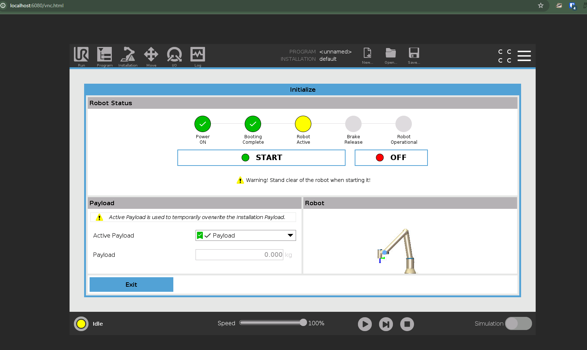
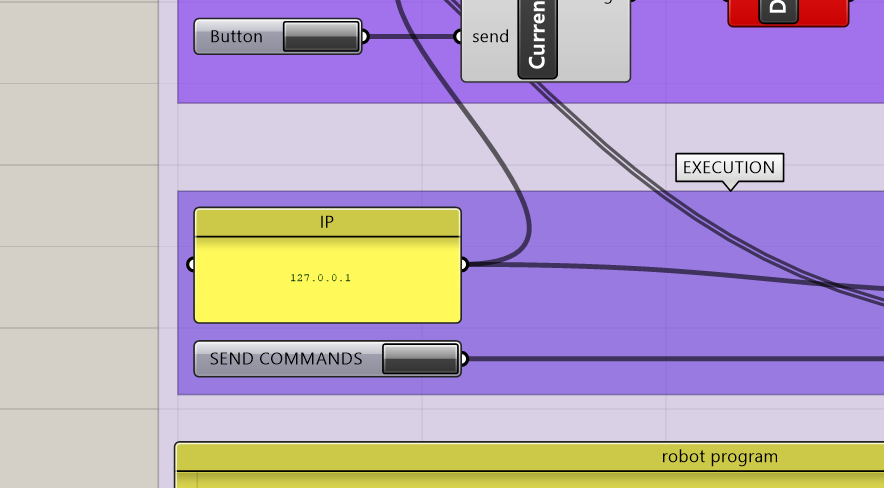

# Running a robot simulator

If you want to test your robot code without having a physical robot, you can use a robot simulator.
Universal Robots provides a simulator for their robots, which is totally free. It depends on a tool called "Docker", which is also free.
Docker is a system to run something akin to a virtual machine, but it's much lighter and faster than a traditional virtual machine.

To run the simulator, you first need to install Docker and we also recommend installing the docker extension of VS Code:

- Download and install Docker Desktop: https://www.docker.com/products/docker-desktop
- Docker extension for VS Code: https://marketplace.visualstudio.com/items?itemName=ms-azuretools.vscode-docker

NOTE: After installation on Windows, it might be required to enable Virtualization on the BIOS of the computer. If you don't know how to do this, please ask us directly via email!

Once the installation is completed, restart your machine.

## Launching the simulator

1. Make sure "Docker Desktop" is running.
2. Open VS Code
3. Go to the `docker` folder, and then `ursim` folder, and open one of the two files in there, depending on whether you want to simulate the `UR10e` or the `UR10` robot. For example, for the `UR10e`, you can open the `docker-compose-ur10e.yml` file.
4. Right-click on the file and select "Compose Up" to start the simulator.

The first time you do this, it will download a rather large file from the internet, but subsequent runs will be much faster.

After the process of starting is done, you can go to your browser, and navigate to the following address:

```
    http://localhost:6080/vnc.html
```

You should see the simulated flex pendant of the robot.



## Sending commands to the simulated robot

Once the simulator is running, you can connect to it as if it were the real robot. The only thing you need to change in the Grasshopper file is the IP address in the yellow panel `IP` to be `127.0.0.1`.

